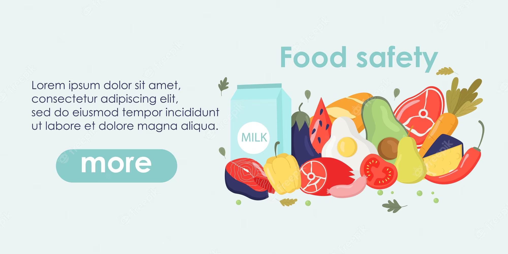

# Food Scan Genius: Your Ultimate Guide to Smart Food Choices

Living with food allergies or specific dietary restrictions? Say hello to **Food Scan Genius**, the app designed with you in mind. Dive into the most comprehensive and reliable tool for food choices tailored to your needs.

👉 Explore the app here: https://scangeni.us/

## 🍏 Understanding the Need

Navigating the world of food products, especially with food allergies or dietary needs, is not just tricky but also crucial. The sheer range of consequences from consuming unsuitable ingredients can range from mild discomfort to severe life-threatening reactions. The demand for a comprehensive tool has never been higher.

## 🍓 Why Food Scan Genius?

**3.5 Million Product SKUs** from around the world reside in our database. Our edge is the combination of public and private datasets, ensuring unmatched accuracy and reliability. Our mission is to give you not just allergen information, but an all-rounded view into your food choices.

## 🍍 Core Features

- **Barcode Scanner**: Your instant guide to allergen and dietary checks.
  
- **Extensive Allergen Database**: Catering to a vast spectrum of food allergies and intolerances.
  
- **Nutritional and Ingredient Insights**: More than just allergens. Delve into detailed nutritional content, discover additives, preservatives, and more.
  
- **Personalized Profiles**: Your needs, your profile. Tailor it to suit you and your loved ones.
  
- **Allergen Alerts & Warnings**: Real-time updates to keep you informed and safe.
  
- **Location Finder**: On the go? Find allergen-friendly grocery stores and restaurants nearby.

## 🍔 What Users are Saying

> "Food Scan Genius has been a game-changer for me. I can't imagine life without it!" - **Sarah T.**
  
> "This app has revolutionized the way I navigate the grocery store. It's a lifesaver!" - **Nikoleta D.**
  
> "Highly recommend for anyone looking for safe products and restaurants." - **Marko Đ.**

## 🥑 Get Started

Available on both **iOS** and **Android**, you can start with Food Scan Genius for free! Dive into our range of features, including our barcode scanner and database. For an enhanced experience, check out our premium version, boasting features like unlimited scans and personalized recommendations.

## 🛠 Technology Stack

Creating **Food Scan Genius** involved using a cutting-edge technology stack. Here's a breakdown:

### 📱 Frontend
- 🦋 **Flutter**: Cross-platform mobile app development ensuring seamless performance on iOS and Android.

### 🌍 Backend
- 🌐 **Node.js**: Efficient and scalable server operations backbone.
- ☁️ **AWS (Amazon Web Services)**:
    - **AWS Lambda**: Backend functions responsive to HTTP requests.
    - **Amazon API Gateway**: Manage and route backend requests.
  
### 🗄️ Database
-  🍃  **MongoDB**: Flexible NoSQL database, apt for our extensive product SKUs.

Our commitment is to innovation. We continuously integrate new technologies to ensure **Food Scan Genius** remains at the technological forefront.

## 🌯 Wrapping it up

Break free from the painstaking label readings. Embrace the genius of effortless, safe, and smart food choices. Get Food Scan Genius today and revolutionize your food shopping experience!

---

Made with ❤️ by Ilija Dončić and Nikola Pešić.
